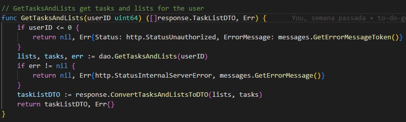

# To-Do App - GO

Para executar o projeto é necessário a criação de um arquivo .env na raiz do projeto contendo os valores, ou criação das variáveis de ambiente a seguir

- MAIL_FROM - email da aplicação que enviará os emails de recuperação de senha ou ativação de usuário
- MAIL_PASSWORD - senha do email
- MAIL_SMTP_HOST - host do email (smtp.gmail.com por exemplo)
- MAIL_SMTP_PORT - porta de acesso ao host de email

- DB_USER - usuário do banco de dados
- DB_PASSWORD - senha do banco de dados
- DB_NAME - schema do banco de dados

- SECRET_KEY - utilizado para geração de jwt
- API_PORT - porta onde a aplicação vai rodar, pode ser 8080

As tabelas de banco de dados não são criadas ou alteradas pela aplicação, mas foi disponibilizado script criado para definição das tabelas.  

Posteriormente são configuradas as rotas para endpoints da API, para isso foi configurado o mux.Router no pacote de rotas.
As rotas foram configuradas a partir de um array de struct, dessa forma verificando atributos para validar o uso ou não de middleware de autenticação.

Os controllers são cadastrados na configuração das rotas, configurando os endpoints, controllers e método HTTP, os controllers acionam uma camada de negócio.  

Nessa camada de negócio são realizadas validações, transformação de dados e acionamento da camada DAO.  

A camada DAO gerencia as conexões com a base de dados e aciona a camada de repositório, responsável por realizar as operações de dados na base de dados.

