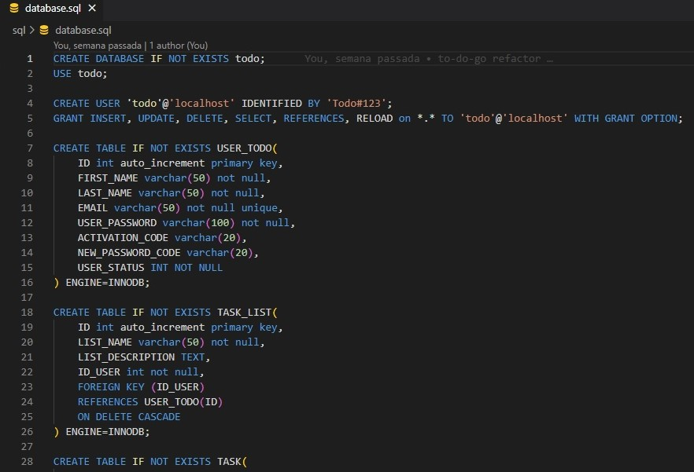

# To-Do App - Kotlin

Para executar o projeto é necessário a criação de um arquivo .env na raiz do projeto contendo os valores, ou criação das variáveis de ambiente a seguir

- MAIL_FROM - email da aplicação que enviará os emails de recuperação de senha ou ativação de usuário
- MAIL_PASSWORD - senha do email
- MAIL_SMTP_HOST - host do email (smtp.gmail.com por exemplo)
- MAIL_SMTP_PORT - porta de acesso ao host de email

As tabelas de banco de dados não são criadas ou alteradas pela aplicação, mas foi disponibilizado script criado para definição das tabelas.



A aplicação foi criada utilizando framework Spring e Spring Boot, além outras dependências como mostrado abaixo:

```
    <dependencies>
		<dependency>
			<groupId>org.springframework.boot</groupId>
			<artifactId>spring-boot-starter-data-jpa</artifactId>
		</dependency>
		<dependency>
			<groupId>org.springframework.boot</groupId>
			<artifactId>spring-boot-starter-mail</artifactId>
		</dependency>
		<dependency>
			<groupId>org.springframework.boot</groupId>
			<artifactId>spring-boot-starter-web</artifactId>
		</dependency>
		<dependency>
			<groupId>com.fasterxml.jackson.module</groupId>
			<artifactId>jackson-module-kotlin</artifactId>
		</dependency>
		<dependency>
			<groupId>org.jetbrains.kotlin</groupId>
			<artifactId>kotlin-reflect</artifactId>
		</dependency>
		<dependency>
			<groupId>org.jetbrains.kotlin</groupId>
			<artifactId>kotlin-stdlib-jdk8</artifactId>
		</dependency>

		<dependency>
			<groupId>com.google.code.gson</groupId>
			<artifactId>gson</artifactId>
			<version>2.10.1</version>
		</dependency>

		<dependency>
			<groupId>io.jsonwebtoken</groupId>
			<artifactId>jjwt-api</artifactId>
			<version>0.11.5</version>
		</dependency>
		<dependency>
			<groupId>io.jsonwebtoken</groupId>
			<artifactId>jjwt-impl</artifactId>
			<version>0.11.5</version>
			<scope>runtime</scope>
		</dependency>
		<dependency>
			<groupId>io.jsonwebtoken</groupId>
			<artifactId>jjwt-jackson</artifactId>
			<version>0.11.5</version>
			<scope>runtime</scope>
		</dependency>

		<dependency>
			<groupId>com.mysql</groupId>
			<artifactId>mysql-connector-j</artifactId>
			<scope>runtime</scope>
		</dependency>
		<dependency>
			<groupId>org.springframework.boot</groupId>
			<artifactId>spring-boot-starter-test</artifactId>
			<scope>test</scope>
		</dependency>
	</dependencies>
```

A aplicação foi separada em camadas, sendo a primeira, que receberá as requisições do usuário, a camada de controller, como a exemplo da classe de controller para operações de autenticação, registro de usuário e recuperação de senha.
as exceções são tratadas em um tipo específico criado (BusinessException) que contemplará as respostas com erro, os retornos são feitos com DTO (não entidades) e a entrada de dados com forms (simples classes, semelhantes aos DTOs)

```
@RestController
class AuthController(val authService: AuthService) {

    @PostMapping(
        value = ["/api/auth/login"],
        consumes = [MediaType.APPLICATION_JSON_VALUE],
        produces = [MediaType.APPLICATION_JSON_VALUE]
    )
    fun login(@RequestBody form: LoginForm) = authService.login(form.email, form.password)

    @PostMapping(value = ["/api/auth/recoverpassword"], consumes = [MediaType.APPLICATION_JSON_VALUE])
    fun recoverPassword(@RequestBody form: RecoverPasswordForm) {
        authService.recoverPassword(form.email.trim { it <= ' ' }
            .lowercase(Locale.getDefault()))
    }

    @PostMapping(
        value = ["/api/auth/passwordreset"],
        consumes = [MediaType.APPLICATION_JSON_VALUE],
        produces = [MediaType.APPLICATION_JSON_VALUE]
    )
    fun passwordReset(@RequestBody form: PasswordResetForm) = authService.resetPasswordByCode(
            form.email.trim { it <= ' ' }.lowercase(Locale.getDefault()),
            form.password.trim { it <= ' ' },
            form.newPasswordCode.trim { it <= ' ' })


    @PostMapping(value = ["/api/auth/userregistration"], consumes = [MediaType.APPLICATION_JSON_VALUE])
    fun registerNewUser(@RequestBody form: UserRegistrationForm) {
        authService.registerUser(
            form.email.trim { it <= ' ' }.lowercase(Locale.getDefault()),
            form.password.trim { it <= ' ' },
            form.firstName.trim { it <= ' ' },
            if (form.lastName != null) form.lastName.trim { it <= ' ' } else null)
    }

    @PostMapping(
        value = ["/api/auth/useractivation"],
        consumes = [MediaType.APPLICATION_JSON_VALUE],
        produces = [MediaType.APPLICATION_JSON_VALUE]
    )
    fun activateUser(@RequestBody form: UserActivationForm): UserDTO {
        return authService.activateUser(
            form.email.trim { it <= ' ' }.lowercase(Locale.getDefault()),
            form.activationCode.trim { it <= ' ' })
    }

    @PostMapping(value = ["/api/auth/useractivationrequest"], consumes = [MediaType.APPLICATION_JSON_VALUE])
    fun requestUserActivation(@RequestBody form: RequestUserActivationForm) {
        authService.requestUserActivation(form.email.trim { it <= ' ' }
            .lowercase(Locale.getDefault()))
    }

    @ExceptionHandler(BusinessException::class)
    fun handleBusinessExceptions(e: BusinessException) = e.generateResponseEntity()

    @ExceptionHandler(Exception::class)
    fun handleExceptions(e: Exception): ResponseEntity<ErrorDTO> {
        e.printStackTrace()
        return if (e is BusinessException) {
            e.generateResponseEntity()
        } else {
            ResponseEntity
                .status(HttpStatus.INTERNAL_SERVER_ERROR)
                .body(ErrorDTO(getErrorMessage()))
        }
    }

}
```

Essa camada de aplicação contém uma referência, injetada pelo Spring, de um serviço, aqui temos as interfaces.

```
interface AuthService {

    @Throws(BusinessException::class)
    fun login(email: String?, password: String?): UserDTO

    @Throws(BusinessException::class)
    fun recoverPassword(email: String?)

    @Throws(BusinessException::class)
    fun resetPasswordByCode(email: String?, newPassword: String?, newPasswordCode: String?): UserDTO

    @Throws(BusinessException::class)
    fun registerUser(email: String?, password: String?, name: String?, lastName: String?)

    @Throws(BusinessException::class)
    fun activateUser(email: String?, activationCode: String?): UserDTO

    @Throws(BusinessException::class)
    fun requestUserActivation(email: String?)
}
```

E as implementações, aqui temos a lógica de negócio e acionamento da camada de repositório e outros serviços, como para envio de emails.

```
@Service
class AuthServiceImpl(
    val userRepository: UserRepository,
    val mailService: MailService,
    val userDTOMapper: UserDTOMapper,
    val utilService: UtilService,
    val taskListService: TaskListService
) : AuthService {

    override fun login(email: String?, password: String?): UserDTO {
        if (!utilService.isMail(email) || password == null || password.length < MIN_LENGTH_PASSWORD)
            throw BusinessException(getErrorMessageInputValues(), BUSINESS_MESSAGE, AppErrorType.INVALID_INPUT)

        val userOptional = userRepository.findByEmail(email!!)
        if (userOptional.isEmpty || !comparePasswordWithHash(userOptional.get().password!!, password))
            throw BusinessException(getErrorMessageLogin(), BUSINESS_MESSAGE, AppErrorType.INVALID_INPUT)
        if (userOptional.get().userStatus == STATUS_INACTIVE)
            throw BusinessException(getErrorMessageUserNotActive(), BUSINESS_MESSAGE, AppErrorType.INVALID_INPUT)

        return userDTOMapper.apply(userOptional.get())
    }

    override fun recoverPassword(email: String?) {
        if (!utilService.isMail(email))
            throw BusinessException(getErrorMessageInputValues(), BUSINESS_MESSAGE, AppErrorType.INVALID_INPUT)

        val userOptional = userRepository.findByEmail(email!!)
        if (userOptional.isEmpty)
            throw BusinessException(getErrorMessageUserNotFound(), BUSINESS_MESSAGE, AppErrorType.INVALID_INPUT)

        val user = userOptional.get()
        if (user.userStatus == STATUS_INACTIVE)
            throw BusinessException(getErrorMessageUserNotActive(), BUSINESS_MESSAGE, AppErrorType.INVALID_INPUT)

        val newPasswordCode = utilService.generateRandomString()
        user.newPasswordCode = newPasswordCode
        mailService.sendNewPasswordEmail(user.email!!, newPasswordCode)
        userRepository.save(user)
    }

    override fun resetPasswordByCode(email: String?, newPassword: String?, newPasswordCode: String?): UserDTO {
        if (!validateResetPasswordInput(email!!, newPassword, newPasswordCode))
            throw BusinessException(
                getErrorMessageInputValues(),
                BUSINESS_MESSAGE,
                AppErrorType.INVALID_INPUT
            )

        val userOptional = userRepository.findByEmail(email)
        if (userOptional.isEmpty)
            throw BusinessException(
                getErrorMessageUserNotFound(),
                BUSINESS_MESSAGE,
                AppErrorType.INVALID_INPUT
            )

        val user = userOptional.get()
        if (user.newPasswordCode != newPasswordCode!!.trim { it <= ' ' })
            throw BusinessException(getErrorMessageInputValues(), BUSINESS_MESSAGE, AppErrorType.INVALID_INPUT)
        user.newPasswordCode = null
        user.userStatus = STATUS_ACTIVE
        user.activationCode = null
        user.password = utilService.generateHashString(newPassword!!.trim { it <= ' ' })
        userRepository.save(user)
        return userDTOMapper.apply(user)
    }

    override fun registerUser(email: String?, password: String?, name: String?, lastName: String?) {
        if (!validateNewUserInput(email, password, name))
            throw BusinessException(
                getErrorMessageInputValues(),
                BUSINESS_MESSAGE,
                AppErrorType.INVALID_INPUT
            )

        val userOptional = userRepository.findByEmail(email!!)
        if (userOptional.isPresent)
            throw BusinessException(
                getErrorMessageEmailAlreadyExists(),
                BUSINESS_MESSAGE,
                AppErrorType.INVALID_INPUT
            )

        val user = User()
        user.id = null
        user.firstName = name!!.trim { it <= ' ' }
        user.lastName = lastName?.trim { it <= ' ' }
        user.email = email.trim { it <= ' ' }
        user.password = utilService.generateHashString(password!!.trim { it <= ' ' })
        user.activationCode = utilService.generateRandomString()
        user.userStatus = STATUS_INACTIVE
        user.newPasswordCode = null
        val newUser = userRepository.save(user)
        taskListService.createDefaultListForNewUser(newUser.id)
        mailService.sendActivationEmail(newUser.email!!, newUser.activationCode!!)
    }

    override fun activateUser(email: String?, activationCode: String?): UserDTO {
        if (!utilService.isMail(email) || activationCode == null || activationCode.trim { it <= ' ' }.length != LENGTH_ACTIVATION_CODE)
            throw BusinessException(
                getErrorMessageInputValues(),
                BUSINESS_MESSAGE,
                AppErrorType.INVALID_INPUT
            )

        val userOptional = userRepository.findByEmail(email!!.trim { it <= ' ' })
        if (userOptional.isEmpty)
            throw BusinessException(
                getErrorMessageUserNotFound(),
                BUSINESS_MESSAGE,
                AppErrorType.INVALID_INPUT
            )

        val user = userOptional.get()
        if (user.activationCode != activationCode.trim { it <= ' ' })
            throw BusinessException(
                getErrorMessageInputValues(),
                BUSINESS_MESSAGE,
                AppErrorType.INVALID_INPUT
            )

        user.activationCode = null
        user.userStatus = STATUS_ACTIVE
        userRepository.save(user)
        return userDTOMapper.apply(user)
    }

    override fun requestUserActivation(email: String?) {
        if (!utilService.isMail(email))
            throw BusinessException(
                getErrorMessageInputValues(),
                BUSINESS_MESSAGE,
                AppErrorType.INVALID_INPUT
            )

        val userOptional = userRepository.findByEmail(email!!.trim { it <= ' ' })
        if (userOptional.isEmpty)
            throw BusinessException(
                getErrorMessageUserNotFound(),
                BUSINESS_MESSAGE,
                AppErrorType.INVALID_INPUT
            )

        val user = userOptional.get()
        user.activationCode = utilService.generateRandomString()
        userRepository.save(user)
        mailService.sendActivationEmail(user.email!!, user.activationCode!!)
    }

    private fun comparePasswordWithHash(hash: String, password: String): Boolean {
        return hash == utilService.generateHashString(password)
    }

    private fun validateResetPasswordInput(email: String?, newPassword: String?, newPasswordCode: String?) =
        utilService.isMail(email)
                && newPasswordCode != null && newPassword != null
                && newPasswordCode.trim { it <= ' ' }.length >= LENGTH_NEW_PASSWORD_CODE
                && newPassword.trim { it <= ' ' }.length >= MIN_LENGTH_PASSWORD

    private fun validateNewUserInput(email: String?, password: String?, name: String?) =
        utilService.isMail(email)
                && password != null && password.trim { it <= ' ' }.length >= MIN_LENGTH_PASSWORD
                && name != null && name.trim { it <= ' ' }.isNotEmpty()
}
```

Por fim temos a camada de acesso aos dados, aqui foi implementada utilizando SpringDataJPA.

```
interface UserRepository : JpaRepository<User, Int> {

    fun findByEmail(email: String): Optional<User>

    @Transactional
    @Modifying
    @Query(value = "UPDATE User u set u.firstName = :name, u.lastName = :lastName WHERE u.id = :id")
    fun updateUserData(@Param("id") id: Int, @Param("name") name: String, @Param("lastName") lastName: String?)

    @Transactional
    @Modifying
    @Query(value = "UPDATE User u set u.password = :password WHERE u.id = :id")
    fun updateUserPassword(@Param("id") id: Int, @Param("password") password: String)

}
```

