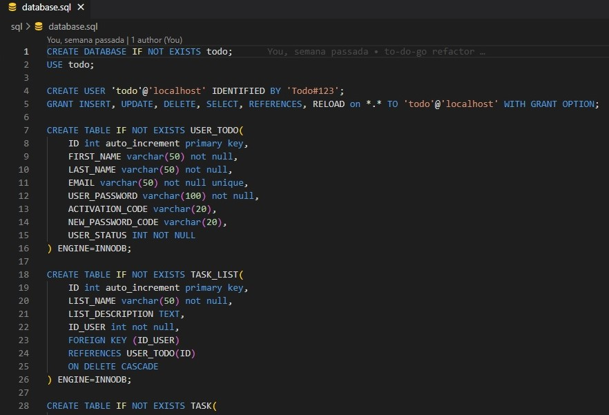

# To-Do App - NodeJS

Para executar o projeto é necessário a criação de um arquivo .env na raiz do projeto contendo os valores, ou criação das variáveis de ambiente a seguir

- MAIL_FROM - email da aplicação que enviará os emails de recuperação de senha ou ativação de usuário
- MAIL_PASSWORD - senha do email
- MAIL_SMTP_HOST - host do email (smtp.gmail.com por exemplo)
- MAIL_SMTP_PORT - porta de acesso ao host de email
- DB_HOST - host do banco de dados (localhost por exemplo)
- DB_USER - usuário do banco de dados
- DB_PASSWORD - senha de acesso ao banco de dados
- DB_NAME - schema do banco de dados
- SECRET_KEY - chave para criação, assinatura e validação de tokens jwt
- API_PORT - porta de exposição da API (8080 por exemplo)

As tabelas de banco de dados não são criadas ou alteradas pela aplicação, mas foi disponibilizado script criado para definição das tabelas.



A aplicação foi criada utilizando typescript e framework Express, além outras dependências como mostrado abaixo:

```
"dependencies": {
    "bcrypt": "^5.1.0",
    "body-parser": "^1.20.2",
    "cors": "^2.8.5",
    "dotenv": "^16.0.3",
    "email-validator": "^2.0.4",
    "express": "^4.18.2",
    "jsonwebtoken": "^9.0.0",
    "mysql": "^2.18.1",
    "mysql2": "^3.3.1",
    "nodemailer": "^6.9.2"
}
```

A aplicação foi separada em camadas, sendo a primeira, que receberá as requisições do usuário, a camada de controller, como a exemplo da classe de controller para operações de autenticação, registro de usuário e recuperação de senha.
as exceções são tratadas em um tipo específico criado (Error) que contemplará as respostas com erro, os retornos são feitos com DTO (não entidades).

```
const login = (req: Request, res: Response) => {
    if (!req.body) {
        return res.status(AppErrorType.INVALID_INPUT).json({
            errorMessage: msg.getErrorMessageInputValues()
        });
    }
    authService.login(req.body.email, req.body.password)
        .then(userDTO => res.status(200).json(userDTO))
        .catch(err => {
            if (err instanceof Error) return res.status(err.errorType).json({ errorMessage: err.errorMessage })
            else return res.status(AppErrorType.INTERN_ERROR).json({ errorMessage: msg.getErrorMessage() })
        })
}
```

Essa camada de aplicação referencia a camada de serviço usando apenas chamadas de funções, como são realizadas operações assíncronas (como acesso ao banco de dados), a aplicação foi projetada para uso de promises, esse padrão foi escolhido pela simplicidade da aplicação, onde podemos tratar os erros de forma facilitada.

```
const login = (email: string | null, password: string | null): Promise<UserDTO> => {
    return new Promise((resolve, reject) => {
        if (!validateLoginData(email, password))
            return reject(new Error(AppErrorType.INVALID_INPUT, msg.getErrorMessageInputValues()));

        userRepo.getUserByEmail(email!.trim().toLowerCase())
            .then(user => {
                if (user === null) return reject(new Error(AppErrorType.INVALID_INPUT, msg.getErrorMessageLogin()));
                const usr = (user as User)
                bcrypt.compare(password!.trim(), usr.password!, function (err, res) {
                    if (err && err !== null)
                        return reject(new Error(AppErrorType.INVALID_INPUT, msg.getErrorMessageInputValues()));
                    if (!res)
                        return reject(new Error(AppErrorType.INVALID_INPUT, msg.getErrorMessageLogin()));
                    if (usr.userStatus <= STATUS_INACTIVE)
                        return reject(new Error(AppErrorType.INVALID_INPUT, msg.getErrorMessageUserNotActive()));
                    return resolve(convertUserToDTO(usr));
                });
            })
            .catch(err => { return reject(new Error(AppErrorType.INTERN_ERROR, msg.getErrorMessage())) })
    })
}
```

Por fim temos a camada de acesso aos dados, aqui foi implementada utilizando apenas o pacote mysql, onde na conexão utilizamos um pool de conexões.

```
import mysql from 'mysql';
import { DB, HOST, PASSWORD, USER } from '../config'

const connection = mysql.createPool({
    host: HOST,
    user: USER,
    password: PASSWORD,
    database: DB,
    waitForConnections: true,
    connectionLimit: 10,
});

export default connection;
```

```
const getUserByEmail = (email: string): Promise<User | null> => {
    return new Promise((resolve, reject) => {
        sql.query(`SELECT ID, EMAIL, USER_PASSWORD, FIRST_NAME, LAST_NAME, USER_STATUS, 
        ACTIVATION_CODE, NEW_PASSWORD_CODE FROM USER_TODO WHERE EMAIL = ?`,
            [email],
            (err: MysqlError | null, results) => {
                if (err != null) { console.log("error: ", err); return reject(err); }
                if (results !== null && results.length > 0) {
                    const user: User = new User(
                        results[0].ID,
                        results[0].FIRST_NAME,
                        results[0].LAST_NAME,
                        results[0].EMAIL,
                        results[0].USER_PASSWORD,
                        results[0].ACTIVATION_CODE,
                        results[0].NEW_PASSWORD_CODE,
                        results[0].USER_STATUS,
                    )
                    return resolve(user);
                }
                return resolve(null);
            });
    })
}
```

